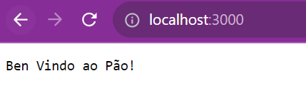
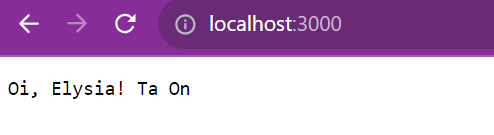
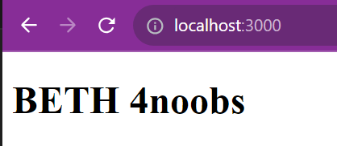
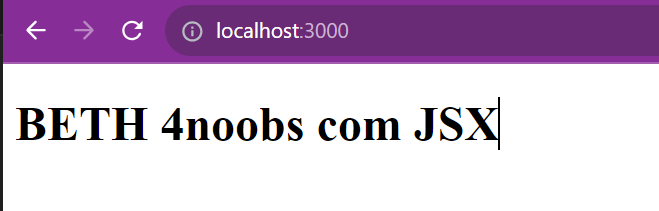
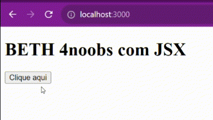
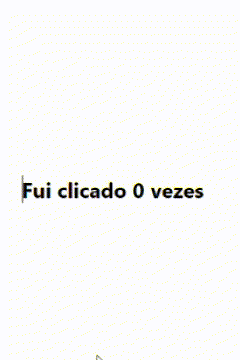

## [B]un 

"Bun é um kit de ferramentas completo para aplicativos JavaScript e TypeScript. Ele é enviado como um único executável chamado bun​."

Vamos instalar o nosso

```bash
curl -fsSL https://bun.sh/install | bash
```

Agora vamos iniciar nosso projeto, para isso vamos executar o comando abaixo:

```bash
bun init
```
Ele solicitará o nome do projeto e o arquivo principal, eu utilizei o nome de beth4noobs e o arquivo principal index.tsx

```bash
Done! A package.json file was saved in the current directory.
 + index.tsx
 + .gitignore
 + tsconfig.json (for editor auto-complete)
 + README.md <--- Esse aqui eu deletei :D
 ```

 Vamos para o `index.tsx` e vamos começar com nosso servidor:
    
```tsx
const server = Bun.serve({
  port: 3000,
  fetch(request) {
    return new Response("Ben Vindo ao Pão!");
  },
});

console.log(`Estou escutando na endereço http://127.0.0.1:${server.port}`);
```

Vamos executar, para isso execute o comando a baixo:

```bash
bun run index.tsx
```


Pronto seu servidor está rodando na porta 3000, agora vamos para a próxima letra.

## [E]lysia 

"Estrutura TypeScript aprimorada pela Bun com segurança de tipo ponta a ponta , sistema de tipo unificado e excelente experiência de desenvolvedor"

Adicionar o pacote Elysia ao nosso projeto

```bash	
bun add elysia
```

Pronto vamos alterar novamente nosso `index.tsx` para:

```tsx
import { Elysia } from "elysia";

const app = new Elysia().get("/", () => "Oi, Elysia! Ta On").listen(3000);

console.log(`Estou escutando na endereço http:/${app.server?.hostname}:${app.server?.port}`);
```

Agora vamos executar novamente:

```bash
bun run index.ts
```



Fizemos a mesma coisa porém usando o Elysia, Porém ta simples demais vamos brincar com HTML.

Vamos adicionar um plugin para o Elysia que vai nos ajudar a trabalhar com HTML.

```bash
bun add @elysiajs/html
```

Agora vamos adicionar no nosso `index.tsx` para:

```tsx
import { Elysia } from "elysia";
import { html } from "@elysiajs/html";

const app = new Elysia()
.use(html())
.get("/", ({html}) => html(htmlBase))
.listen(3000);

console.log(`Estou escutando na endereço http:/${app.server?.hostname}:${app.server?.port}`);

const htmlBase = `
<!DOCTYPE html>
<html lang="pt-br">
  <head>
    <meta charset="UTF-8" />
    <title> BETH 4noobs </title>
  </head>
  <body>
    <h1> BETH 4noobs </h1>
  </body>
</html>
`;
```



Html é chato de escrever, vamos usar jsx para facilitar nossa vida.

## [T]yped-html

"Typed-html é uma biblioteca de criação de elementos HTML para TypeScript. Ele fornece uma maneira de criar elementos HTML usando funções e tipos de dados em vez de strings."

Adicionando o pacote typed-html ao nosso projeto:

```bash
bun add -d typed-html
```

Altere o tsconfig.json para:

```json
{
    "compilerOptions": {
        "jsx": "react",
        "jsxFactory": "elements.createElement"
    }
}
```
E por fim vamos criar um componente

```tsx
import { Elysia } from "elysia";
import { html } from "@elysiajs/html";
import * as elements from 'typed-html';

const app = new Elysia()
  .use(html())
  .get("/", ({ html }) =>
    html(
      <HtmlBase>
        <body>
          <h1> BETH 4noobs com JSX </h1>
        </body>
      </HtmlBase>
    ))
  .listen(3000);

console.log(`Estou escutando na endereço http:/${app.server?.hostname}:${app.server?.port}`);

const HtmlBase = ({ children }: elements.Children) => `
<!DOCTYPE html>
<html lang="pt-br">
  <head>
    <meta charset="UTF-8" />
    <title> BETH 4noobs </title>
  </head>
 ${children}
</html>
`;
```

Agora vamos executar novamente, porém vamos usar o `--hot` para que ele fique escutando as alterações e atualizando o servidor:

```bash
bun --hot run index.ts
```



Hora de ir para a próxima letra.

## [H]tmx

"htmx dá acesso a AJAX, transições CSS, WebSockets e eventos enviados pelo servidor diretamente em HTML, usando atributos, para que você possa construir interfaces de usuário modernas com a simplicidade e o poder do hipertexto

htmx é pequeno (~14k min.gz'd), livre de dependências, extensível, compatível com IE11 e reduziu o tamanho da base de código em 67% quando comparado com react"

Vamos adicionar o pacote htmx ao nosso projeto, adicione a linha abaixo dentro do `<head>` a baixo do `<title>`


```tsx
const HtmlBase = ({ children }: elements.Children) => `
<!DOCTYPE html>
<html lang="pt-br">
  <head>
    <meta charset="UTF-8" />
    <title> BETH 4noobs </title>
    <script src="https://unpkg.com/htmx.org@latest"></script>
  </head>
 ${children}
</html>
`;
```
Agora vamos adicionar um botão para ver o funcinamento do htmx no nosso componente, além disso criaremos um novo endpoint para receber a requisição do botão usando htmx.


```tsx
.get("/", ({ html }) =>
    html(
      <HtmlBase>
        <body>
          <h1> BETH 4noobs com JSX </h1>
          <button hx-get="/clicado/0" hx-swap="outerHTML"> Clique aqui </button>
        </body>
      </HtmlBase>
    ))
  .get("/clicado/:contador", ({ params: { contador } }) => {
    const contadorAtual = Number(contador) + 1;
    return (
      <button hx-get={`/clicado/${contadorAtual}`} hx-swap="outerHTML">
        Fui clicado {contadorAtual} vezes
      </button>
    );
  })
```



Hora de deixar bunito, vamos adicionar o tailwind ao nosso projeto.

Vamos adicionar o pacote tailwind ao nosso projeto, adicione a linha abaixo dentro do `<head>` a baixo do `<title>` e do `<script>` do htmx


```tsx
const HtmlBase = ({ children }: elements.Children) => `
<!DOCTYPE html>
<html lang="pt-br">
  <head>
    <meta charset="UTF-8" />
    <title> BETH 4noobs </title>
    <script src="https://unpkg.com/htmx.org@latest"></script>
    <script src="https://cdn.tailwindcss.com"></script>
  </head>
 ${children}
</html>
`;
```

Agora vamos remover o `<h1>` e centralizar o `<body>` e transformar o botão em um componente para não ficarmos repetindo código.

```tsx
const app = new Elysia()
  .use(html())
  .get("/", ({ html }) =>
    html(
      <HtmlBase>
        <body class="flex w-full h-screen justify-center items-center">
          <BotaoContador contador={0} />
        </body>
      </HtmlBase>
    ))
  .get("/clicado/:contador", ({ params: { contador } }) => {
    const contadorAtual = Number(contador) + 1;
    return (
      <BotaoContador contador={contadorAtual} />
    );
  })
  .listen(3000);

console.log(`Estou escutando na endereço http:/${app.server?.hostname}:${app.server?.port}`);

const BotaoContador = ({ contador }: { contador: number }) => `
<button 
  class="font-bold hover:bg-white hover:text-indigo-500"
  hx-get="/clicado/${contador}" hx-swap="outerHTML">
  Fui clicado ${contador} vezes
</button>
`;
```

Além de colorido agora ele muda de cor quando passamos o mouse em cima.



## Revisão

É hora da revisão, vamos ver o que aprendemos até agora.

- [x] Bun
    Usa o bun para iniciar o projeto
- [x] Elysia
    Usa o elysia para criar um servidor amigável
- [x] Typed-html
    Usa o typed-html para criar componentes html
- [x] Htmx
    Usa o htmx para fazer requisições ajax
- [x] Tailwind
    Usa o tailwind para deixar o projeto bonito

## Próximos passos

Vamos criar um projeto com regras de negócio mais complexas, e vamos utilizar as tecnologias que aprendemos até agora e vamos adicionar mais algumas.

Até a próxima :D

